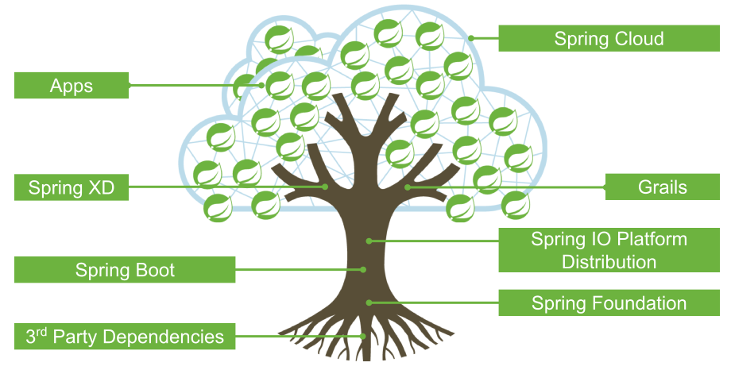

# Spring Cloud, Spring Boot and Netflix OSS

Spencer Gibb   
twitter: [@spencerbgibb](http://twitter.com/spencerbgibb)   
email: sgibb@pivotal.io   

Dave Syer   
twitter: [@david_syer](http://twitter.com/david_syer)   
email: dsyer@pivotal.io   

(_Spring Boot and Netflix OSS_    
or _Spring Cloud Components_)

## Outline
* Outline some distributed system problems
* Introduce Netflix OSS and its integration with Spring Boot
* Spring Cloud demos

## Spring Boot and Microservices

It needs to be super easy to implement and update a service:

```groovy
@RestController
class ThisWillActuallyRun {
    @RequestMapping("/")
    String home() {
        Hello World!
    }
}
```

and you don't get much more "micro" than that.

## Cloud Foundry

Deploying services needs to be simple and reproducible

```
$ cf push app.groovy
```

and you don't get much more convenient than that.

(Same argument for other PaaS solutions)

## Continuous Delivery

* Microservices lend themselves to continuous delivery.
* You actually *need* continuous delivery to extract maximum value.
* **New:** ALM support in Cloudfoundry from Cloudbees

Book (Humble and Farley): [http://continuousdelivery.com](http://continuousdelivery.com/)
Netflix Blog: [http://techblog.netflix.com/2013/08/deploying-netflix-api.html](http://techblog.netflix.com/2013/08/deploying-netflix-api.html)

## Example Distributed System: Minified

<style>img[alt=customer-stores-blank] { width: 80%; }</style>


## No Man (Microservice) is an Island

> It's excellent to be able to implement a microservice really easily
> (Spring Boot), but building a system that way surfaces
> "non-functional" requirements that you otherwise didn't have.

There are laws of physics and probability that make some problems
unsolvable (consistency, availability, latency), but brittleness and
manageability can be addressed with *generic*, *boiler plate*
patterns.

## Emergent features of micro-services systems

Coordination of distributed systems leads to boiler plate patterns

* Distributed/versioned configuration
* Service-to-service calls
* Service registration and discovery
* Routing
* Load balancing
* Circuit Breaker
* Asynchronous + reactive
* Distributed messaging

## Spring IO Platform



## Example: Coordination Boiler Plate

<style>img[alt=customer-stores-system] { width: 72%; }</style>


## Netflix OSS

* Eureka
* Hystrix & Turbine
* Ribbon
* Feign
* Zuul
* Archaius

* Curator
* Asgaard
* ...

[Mikey Cohen Netflix edge architecture, http://goo.gl/M159zi](http://goo.gl/M159zi)

## Example: Spring Cloud and Netflix

<style>img[alt=customer-stores] { width: 72%; }</style>


## Configuration Server
* Pluggable source
* Git implementation
* Versioned
* Rollback-able
* Strong encryption

## Config Client
Consumers of config server can use client library as Spring Boot plugin

Features:

* Bootstrap `Environment` from server
* POST to /env to change `Environment`
* `@RefreshScope` for atomic changes to beans via Spring lifecycle
* POST to /refresh
* POST to /restart

## Discovery: Eureka
* Service Registration Server
* Highly Available
* Services have metadata
* In AWS terms, multi Availability Zone and Region aware

## Circuit Breaker: Hystrix

Reilience pattern:

* latency and fault tolerance
* isolates access to other services
* stops cascading failures
* dashboard

Release It!: [https://pragprog.com/book/mnee/release-it](https://pragprog.com/book/mnee/release-it)

## Hystrix Fallback

<style>img[alt=hystrix] { width: 92%; }</style>


## Declarative Hystrix Commands

```java
@HystrixCommand(fallbackMethod="getDefaultMessage")
public String getMessage() {
  return restTemplate.getForObject(/*...*/);
}

private String getDefaultMessage() {
  return "Hello World Default";
}
```

```java
//somewhere else
helloService.getMessage();
```

## Circuit Breaker Metrics

* Via actuator `/metrics`
* Server side event stream `/hystrix.stream`
* Dashboard app with `@EnableHystrixDashboard`
* Aggregation via Spring Cloud Bus Turbine

## Routing: Zuul
* JVM based router and filter
* Similar routing role as httpd, nginx, or CF go router
* Fully programmable rules and filters
* Groovy
* Java
* Any JVM language

## How Netflix uses Zuul
* Authentication
* Insights
* Stress Testing
* Canary Testing
* Dynamic Routing
* Service Migration
* Load Shedding
* Security
* Static Response handling
* Active/Active traffic management

## Spring Cloud Zuul Proxy
* Store routing rules in config server   
   `zuul.proxy.route.customers: /customers`
* Uses `Hystrix->Ribbon->Eureka` to forward requests to appropriate service

```groovy
@EnableZuulProxy
@Controller
class Application {
  @RequestMapping("/")
  String home() { 
    return 'redirect:/index.html#/customers'
  }
}
```

* Can be used as "sidecar" (or standalone edge server) via `@EnableSidecar`

## Links

* [http://github.com/spring-cloud](http://github.com/spring-cloud)
* [http://github.com/spring-cloud-samples](http://github.com/spring-cloud-samples)
* [http://blog.spring.io](http://blog.spring.io)
* [http://presos.dsyer.com/decks/cloud-boot-netflix.html](http://presos.dsyer.com/decks/cloud-boot-netflix.html)
* Twitter: [@spencerbgibb](http://twitter.com/spencerbgibb), [@david_syer](http://twitter.com/david_syer)
* Email: sgibb@pivotal.io, dsyer@pivotal.io
