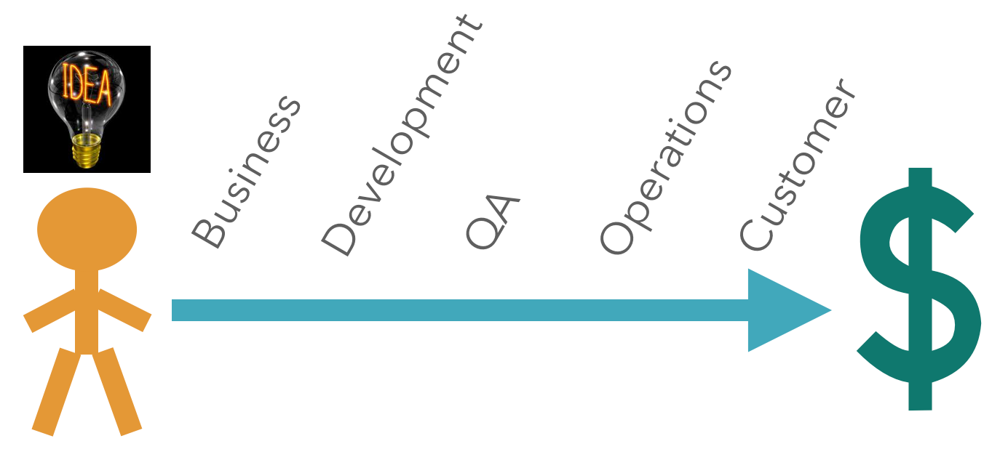
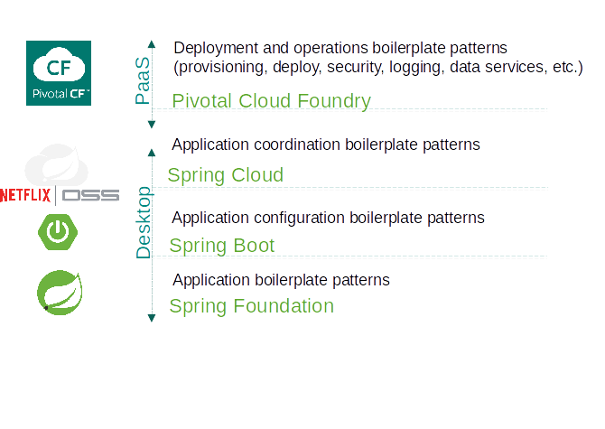

= Cloud Native Application Architecture
Dave Syer, 2015
:backend: deckjs
:deckjs_transition: fade
:navigation:
:icons: font
:menu:
:goto:
:hash:
:status:
:scale:
:source-highlighter: pygments
:deckjs_theme: spring
:deckjsdir: ../deck.js

== Does This Sound Good?

* Speed
* Safety
* Scale
* Mobility

== Not Monoliths...

image::images/cloud-native/monoliths.png[]

== Not Traditional (ESB-centric) SOA...

image::images/cloud-native/esb_soa.png[]

== But Microservices!

> Loosely coupled service oriented architecture with bounded contexts...
-- @adrianco

If every service has to be updated in concert, it's not loosely coupled.

If you have to know about the internals of surrounding services you don't have a bounded context.

== Process

- **Deliver** (Day One)
- **Continuously** (Day Two and Beyond)

== Sociology

image::images/cloud-native/inverse_conway.png[inverse-conway]

== Some Practical Advice

_Paraphrasing @adrianco:_

[.big]
Get out of the business of infrastructure *and* +
automation (a.k.a. "undifferentiated heavy lifting")

{nbsp} +

- Internet giants, ratio of app to infra developers = 10:1
- Your business (= your apps) is special, your infrastructure is not
- Don't try to differentiate on something that is a commodity

== You're Going to Need a Platform

Platform features:

[frame="none",grid="none"]
|===
| **Infrastructure** | **Application**

| Environment Provisioning
| Distributed/Versioned Config

| On-Demand/Automatic Scaling
| Service Registration/Discovery

| Failover Resilience
| Routing/Load Balancing

| Routing/Load Balancing
| Service Integration

| Data Service Operations
| Fault Tolerance

| Monitoring
| Asynchronous Messaging
|===

== Anatomy of a Cloud Platform

== What is Cloud Native?

> If you make the rule that you own the code that you write, you soon get to know what #cloudnative means!
-- @david_syer

== Links

* http://presos.dsyer.com/decks/cloud-native.html
* http://cloud.spring.io
* http://projects.spring.io/spring-boot
* http://spring.io/blog
* https://github.com/spring-cloud
* https://github.com/spring-cloud-samples
* https://github.com/springone2gx2015
