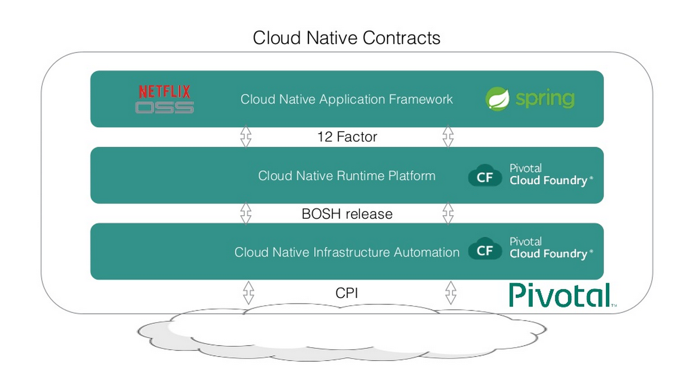

= Cloud Native Application Architecture
Dave Syer, 2015
:backend: deckjs
:deckjs_transition: fade
:navigation:
:icons: font
:menu:
:goto:
:hash:
:status:
:scale:
:source-highlighter: pygments
:deckjs_theme: spring
:deckjsdir: ../deck.js

== Authors

Dave Syer, +
http://twitter.com/david_syer[@david_syer], +
dsyer@pivotal.io

(with thanks to @mstine)

== Why Cloud Native?

* Speed
* Safety
* Scale
* Mobility

== What is Cloud Native?

> If you make the rule that you own the code that you write, you soon get to know what #cloudnative means!
-- @david_syer

* Twelve Factor Apps (http://12factor.net)
* Microservices
* Self-service, agile infrastructure
* Contract-based collaboration (APIs, messages)
* Antifragility

== Is There Maybe Some Hype?

image::images/cat_with_a_gun_riding_a_unicorn.jpg[cat-with-unicorn]

== Microservice

> Loosely coupled service oriented architecture with bounded contexts...
-- @adrianco

If every service has to be updated in concert, it's not loosely coupled.

If you have to know about the internals of surrounding services you don't have a bounded context.

== Not Monoliths...

image::images/cloud-native/monoliths.png[]

== Not Traditional (ESB-centric) SOA...

image::images/cloud-native/esb_soa.png[]

== But Microservices!

image::images/cloud-native/death_star.png[]

== Monoliths

* Complex / Easy
* Modularity dependent on launguage / framework
* Change cycle tightly coupled -> obstacle to frequent deploys
* Inefficient scaling
* Intimidating to new developers (and for old ones)
* Obstacle to scaling feature development
* Requires long-term commitment to stack

== Microservices

* Simple / Hard
* Modularity based on component services
* change cycle decoupled -> frequent deploys
* Efficient scaling
* Individual components easy to understand
* Enables scaling development
* Eliminates long-term commitment to stack

== Wait, It's Hard?

No such thing as a free lunch

* Operations overhead
* Devops skill shortage
* Interface / context governance
* Duplication of effort
* Distributed system complexity
* Asynchronous is difficult
* Testability challenges

== Enabling Continuous Delivery

image::images/cloud-native/cont_deliv.png[cont-deliv,400]

- **Deliver** (Day One)
- **Continuously** (Day Two and Beyond)

== Cloud Native Objective

[NOTE]
====
Get out of the business of infrastructure *and* automation +
(a.k.a. "undifferentiated heavy lifting")
====

{nbsp} +
{nbsp} +

- Internet giants, ratio of app to infra developers = 10:1
- Your business (= your apps) is special, your infrastructure is not
- Don't try to differentiate on something that is a commodity

== 12-Factor Application Patterns

- Cloud-native application architectures
- Optimized for speed, safety, & scale
- Declarative configuration
- Stateless/shared-nothing processes
- Loose coupling to application environment

== Microframeworks

image:images/cloud-native/dropwizard.png[dropwizard,100] image:images/cloud-native/spring-boot.png[spring-boot,300]

- Dropwizard (http://www.dropwizard.io/)
- Spring Boot (http://projects.spring.io/spring-boot/)

== Spring Boot

- http://projects.spring.io/spring-boot
- Opinionated convention over configuration
- Production-ready Spring applications
- Embed Tomcat, Jetty or Undertow
- *STARTERS*
- Actuator: Metrics, health checks, introspection

== No Microservice is an Island

image::images/cloud-native/island-house.jpg[island-house]

== Challenges of Distributed Systems

* Configuration Management
* Service Registration & Discovery
* Routing & Load Balancing
* Fault Tolerance (Circuit Breakers!)
* Monitoring and Tracing
* API Aggregation & Transformation

== Spring Cloud

- http://projects.spring.io/spring-cloud
- Opinionated convention over configuration
- Common patterns, pre-shaved yaks
- Declarative distributed systems
- Embed Netflix OSS and other popular tools (Zipkin, Kafka, Rabbit, Zookeeper, Consul, Hazelcast, Cloud Foundry)

== You're Going to Need a Platform

Pivotal platform features:

[frame="none",grid="none"]
|===
| Cloud Foundry    | Spring Cloud   image:images/spring-cloud.png[cloud,60]

| Environment Provisioning
| Distributed/Versioned Config

| On-Demand/Automatic Scaling
| Service Registration/Discovery

| Failover Resilience
| Routing/Load Balancing

| Routing/Load Balancing
| Service Integration

| Data Service Operations
| Fault Tolerance

| Monitoring
| Asynchronous Messaging
|===

== Cloud Native Contracts

(With thanks to @littleidea)

== Links

* http://presos.dsyer.com/decks/spring-cloud-dev-experience.html
* http://cloud.spring.io
* http://spring.io/blog
* https://github.com/spring-cloud
* https://github.com/spring-cloud-samples
* https://github.com/springone2gx2015
