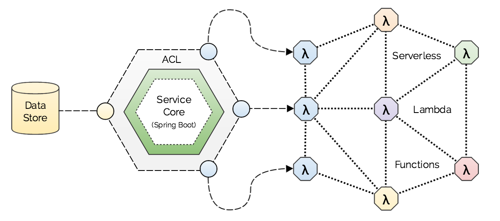
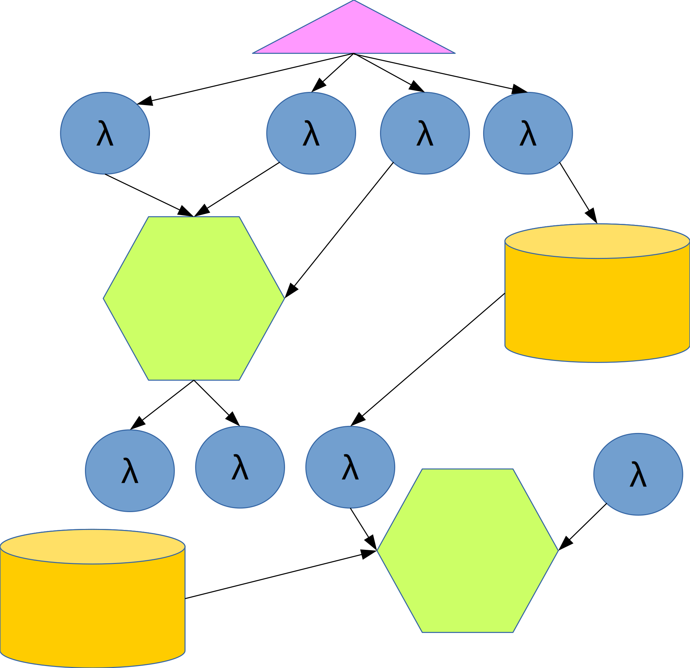
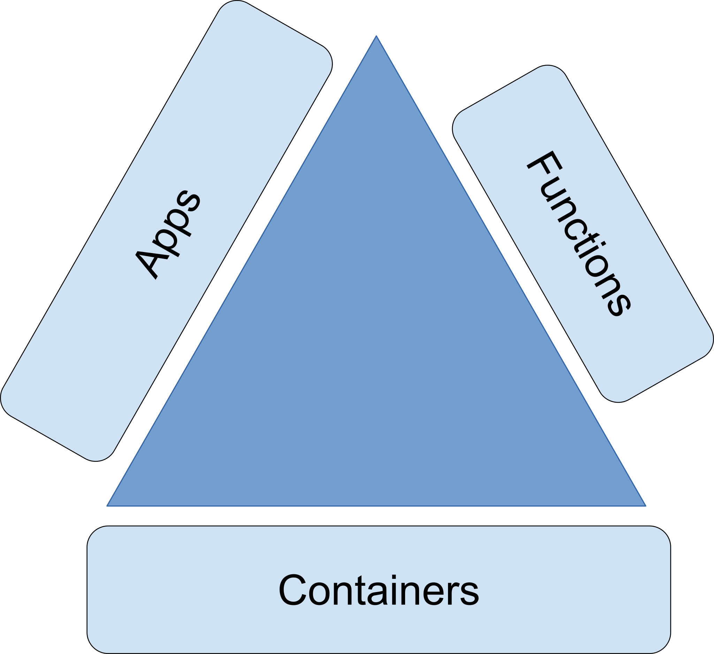
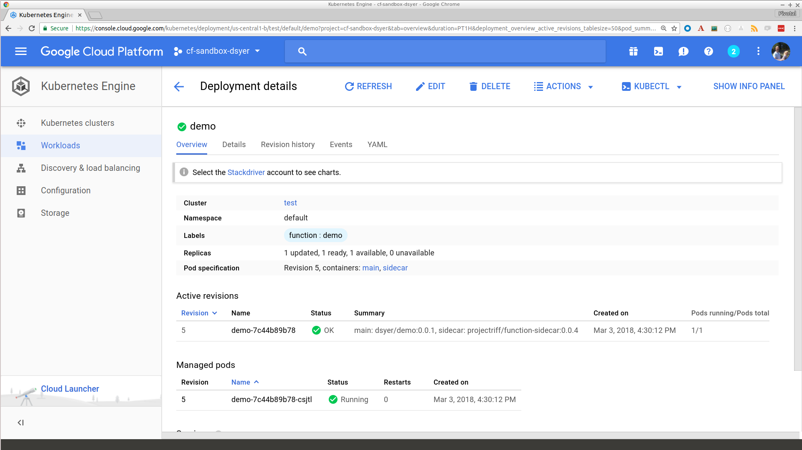

# Functions and Platforms

Dave Syer, 2016  
Twitter: @david_syer  
Email: `dsyer@pivotal.io`

## Agenda

* Platforms and serverless
* Architecture and domain concepts
* Platform convergence

## No Code is an Island

Credit: Yan Cui, https://theburningmonk.com

## Serverless

* Dynamic resource utilization, "scale to zero"
* Billing per message
* Focus on business logic
* Easy integration with platform services

## Service Block

## Idealized Serverless Architecture

## What is Missing?

* Architectural cohesion
* Observability
* On premise and BYO services
* Vendor neutrality

## More Often...

What Can We Do?

## Convergence of Platforms

Abstractions are a good thing

But not everything is a function

So platforms adapt to real needs...

## Cloud Abstractions

## Cloud Abstractions

## Abstraction Trade Offs

Higher level of abstraction means:

* Higher value line          :-)
* Less control               :-(

But: you need to pick your battles.

Not all abstractions are helpful for all problems.

## A Platform for Devops

N.B. a developer does not care what is in the middle

## A Platform for Devops

## Riff

## Links

* Spring Cloud Function: https://github.com/spring-cloud/spring-cloud-function
* Riff: https://github.com/projectriff/riff
* Cloud Events: https://github.com/cloudevents/spec
* Spring Tip: https://youtu.be/E55oAtOhWZU
