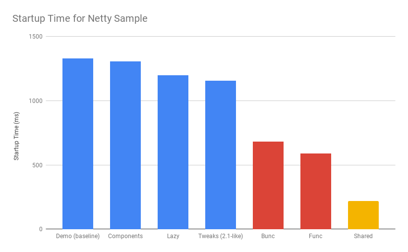

= How Fast is Spring?
Dave Syer, 2018
:backend: deckjs
:deckjs_transition: fade
:navigation:
:icons: font
:menu:
:goto:
:hash:
:status:
:scale:
:source-highlighter: pygments
:deckjs_theme: spring
:deckjsdir: ../deck.js

== Agenda

* How much work is Spring doing, compared to other parts of your app?
* Tools for measurement
* Comparison between various classpath and packaging choices
* Speeding things up
* The future

== Baseline Micro App



== Spring Boot 2.1

image::https://docs.google.com/spreadsheets/d/e/2PACX-1vQpSEfx0Y1W9aD3XVyn91-S0jtUp2DRCQSy_W_LMGyMR91YLAQ1mL7MiR1BRd8VzshvtuxzL6WAnlxf/pubchart?oid=1818051570&format=image[startup-2.1.x,width=75%]

== Heap Memory and Garbage Collection

image::https://docs.google.com/spreadsheets/d/e/2PACX-1vQpSEfx0Y1W9aD3XVyn91-S0jtUp2DRCQSy_W_LMGyMR91YLAQ1mL7MiR1BRd8VzshvtuxzL6WAnlxf/pubchart?oid=336485057&format=image[heap-size-2.1.x,width=75%]

== Garbage Collection

[cols="52a,48a"]
|===
|image::images/fast/flame_20.svg[flame_20]
|image::images/fast/flame_21.svg[flame_21]

| Spring Boot 2.0
| Spring Boot 2.1
|===

== How Fast is Spring?

TL;DR How do I make my app go faster?

* Classpath exclusions from Spring Boot web starters
* Use the `spring-context-indexer`
* Don't use actuators if you can afford not to
* Use Spring Boot 2.1 and Spring 5.1
* Use explicit `spring.config.location`
* Switch off JMX: `spring.jmx.enabled=false`
* Make bean definitions lazy by default
* Unpack the fat jar and run with an explicit classpath
* Run the JVM with `-noverify`. Also consider `-XX:TieredStopAtLevel=1`
* Import autoconfigurations individually
* Use functional bean definition
* (Build a native image)

== Summary

* Spring was designed _ab initio_ to be lightweight
* The engineering team cares *deeply* about performance
* There are many *optional* features
* Packaging: exploded jar with application main is always best
* Server: there is no measureable difference between Tomcat, Jetty and Undertow
* Netty is a _bit_ faster on startup - you won't notice in a large app
* The more features you use, the more classes are loaded
* Functional bean definitions rule
* Spring Boot, HTTP: starts in <1sec and uses <10MB heap

== Tools

* Benchmarks: http://openjdk.java.net/projects/code-tools/jmh/[JMH]
* Profiling: https://github.com/jvm-profiling-tools/async-profiler[async-profiler]
* GC pressure: http://openjdk.java.net/projects/jmc/[JMC] a.k.a. Flight Controller
* Quick metrics for any Spring Boot jar: https://github.com/dsyer/spring-boot-startup-bench/blob/master/launcher/README.adoc[Benchmark launcher] from dsyer/spring-boot-startup.
* Classpath manipulation: https://github.com/dsyer/spring-boot-thin-launcher[Thin Launcher]
* Profiling with https://github.com/dsyer/spring-boot-aspectj/tree/master/timing[AspectJ]

== Benchmarks: Application Startup

https://github.com/dsyer/spring-boot-startup-bench/blob/master/static/README.adoc[Static benchmarks] from https://github.com/dsyer/spring-boot-startup-bench. New JVM (separate process) per application startup, explicit classpath (not fat jar).

```
Benchmark   (sample) Mode  Cnt  Score   Error  Units Beans Classes
MainBenchmark  actr  avgt   10  1.316 ± 0.060   s/op 186   5666
MainBenchmark  jdbc  avgt   10  1.237 ± 0.050   s/op 147   5625
MainBenchmark  demo  avgt   10  1.056 ± 0.040   s/op 111   5266
MainBenchmark  slim  avgt   10  1.003 ± 0.011   s/op 105   5208
MainBenchmark  thin  avgt   10  0.855 ± 0.028   s/op 60    4892
MainBenchmark  lite  avgt   10  0.694 ± 0.015   s/op 30    4580
MainBenchmark  func  avgt   10  0.652 ± 0.017   s/op 25    4378
```

== Number of Classes vs. Startup Time

image::https://docs.google.com/spreadsheets/d/e/2PACX-1vR8B4l5WkWf-9gZWmIYTkmBWM7YWf5bRg852OakrV0G2-vtfM_UkVNRC3cTVk1079HagnMVHYZnvbib/pubchart?oid=976086548&format=image[width=75%]

== WebFlux and Micro Apps

https://github.com/dsyer/spring-boot-startup-bench/blob/master/flux/README.adoc[Flux benchmarks] from https://github.com/dsyer/spring-boot-startup-bench

```
Benchmark            (sample)  Mode  Cnt  Score   Error  Units Classes
MainBenchmark.main       jlog    ss   10  0.933 ± 0.065   s/op 4367
MainBenchmark.main       demo    ss   10  1.081 ± 0.075   s/op 5779
MiniBenchmark.boot       jlog    ss   10  0.486 ± 0.020   s/op 2974
MiniBenchmark.boot       demo    ss   10  0.579 ± 0.041   s/op 4138
MiniBenchmark.mini       jlog    ss   10  0.420 ± 0.011   s/op 2351
MiniBenchmark.mini       demo    ss   10  0.538 ± 0.009   s/op 3138
MiniBenchmark.micro      jlog    ss   10  0.186 ± 0.006   s/op 1371
MiniBenchmark.micro      demo    ss   10  0.288 ± 0.006   s/op 2112
```

== JVM Tweaks

* Command line: `-noverify` `-XX:TieredStopAtLevel=1` `-Djava.security.egd=file:/dev/./urandom`
* Open J9: CDS `-Xquickstart -Xshareclasses -Xscmx128m`
* Java 10/11: CDS, AOT (GraalVM)
* Explicit classpath (exploded archive)

== Open J9

```
Benchmark            (sample)  Mode  Cnt  Score   Error  Units Classes
MainBenchmark.main       jlog    ss   10  0.709 ± 0.034   s/op 4536
MainBenchmark.main       demo    ss   10  0.939 ± 0.027   s/op 5954
MiniBenchmark.boot       jlog    ss   10  0.406 ± 0.085   s/op 3090
MiniBenchmark.boot       demo    ss   10  0.505 ± 0.035   s/op 4314
MiniBenchmark.mini       jlog    ss   10  0.340 ± 0.018   s/op 2427
MiniBenchmark.mini       demo    ss   10  0.432 ± 0.019   s/op 3256
MiniBenchmark.micro      jlog    ss   10  0.152 ± 0.045   s/op 1436
MiniBenchmark.micro      demo    ss   10  0.204 ± 0.019   s/op 2238
```

image::https://docs.google.com/spreadsheets/d/e/2PACX-1vQpSEfx0Y1W9aD3XVyn91-S0jtUp2DRCQSy_W_LMGyMR91YLAQ1mL7MiR1BRd8VzshvtuxzL6WAnlxf/pubchart?oid=1689271723&format=image[width=75%]

== Classpath Exclusions

YMMV, but consider excluding:

* Jackson (`spring-boot-starter-json`)
* Logback (`spring-boot-starter-logging`)
* Hibernate Validator (`org.hibernate.validator:hibernate-validator`)
* Actuators (`spring-boot-starter-actuator`)

== Lazy Beans

* Spring Data `@EnableJpaRepositories(bootstrapMode=BootstrapMode.LAZY)` or `spring.data.jpa.repositories.bootstrap-mode=lazy`
* `BeanFactoryPostProcessor` that switches all beans to `lazy=true`
* Look carefully at custom beans with expensive `@PostConstruct`
* Profiling with https://github.com/dsyer/spring-boot-aspectj/tree/master/timing[AspectJ]
* Lazy subsystems, E.g. see https://github.com/dsyer/spring-boot-lazy-actuator[Lazy Actuator]

== Manual Configuration

Choose your own autoconfigurations: "a la carte" instead of "all you can eat".

```java
@SpringBootConfiguration
@ImportAutoConfiguration({
    WebFluxAutoConfiguration.class,
    ReactiveWebServerFactoryAutoConfiguration.class,
    ErrorWebFluxAutoConfiguration.class,
    HttpHandlerAutoConfiguration.class,
    ConfigurationPropertiesAutoConfiguration.class,
    PropertyPlaceholderAutoConfiguration.class
})
@RestController
public class DemoApplication {

...

}
```

== PetClinic Benchmarks

image::https://docs.google.com/spreadsheets/d/e/2PACX-1vQpSEfx0Y1W9aD3XVyn91-S0jtUp2DRCQSy_W_LMGyMR91YLAQ1mL7MiR1BRd8VzshvtuxzL6WAnlxf/pubchart?oid=1003506885&format=image[]

* Green: manual autoconfiguration.
* Red: different "a la carte" option in Spring Init.
* Blue: out of the box Spring Boot.
* Yellow: fully functional via Spring Init

== Functional Bean Definitions

Before:

```java
@Configuration
public class SampleConfiguration {
    
    @Bean
    public Foo foo() {
        return new Foo();
    }

    @Bean
    public Bar bar(Foo foo) {
        return new Bar(foo);
    }

}
```

== Functional Bean Definitions

After:

```java
public class SampleConfiguration
        implements ApplicationContextInitializer<GenericApplicationContext> {

    public Foo foo() {
        return new Foo();
    }

    public Bar bar(Foo foo) {
        return new Bar(foo);
    }

    @Override
    public void initialize(GenericApplicationContext context) {
        context.registerBean(SampleConfiguration.class);
        context.registerBean(Foo.class,
                () -> context.getBean(SampleConfiguration.class).foo());
        context.registerBean(Bar.class, () -> context.getBean(SampleConfiguration.class)
                .bar(context.getBean(Foo.class)));
    }

}
```

== Result


C.f. `Bunc` vs `Demo`.

== Examples

* Micro apps (`FuncApplication` and `BuncApplication`): https://github.com/dsyer/spring-boot-micro-apps
* Spring Fu: https://github.com/spring-projects/spring-fu
* Spring Init: https://github.com/spring-projects-experimental/spring-init
* Spring Cloud Function `spring.functional.enabled=true`


== CPU Constrained Environments

```
container cpus  startup(ms)
===========================
riff       4       2817
scf        4        664
riff       2       4614
scf        2        653
riff       1      16782
scf        1       2121
scf:n      1       1091
```

* riff is the image built by pack using the riff builder
* scf same app built with WebFlux and functional beans 
* scf:n also switch off background preinit

== Ahead of Time Compilation (AOT)

Native images can be very efficient (see https://github.com/oracle/graal[Graal VM]).

```
$ native-image -H:Name=target/bunc ... com.example.func.BuncApplication
$ ./target/bunc

  .   ____          _            __ _ _
 /\\ / ___'_ __ _ _(_)_ __  __ _ \ \ \ \
( ( )\___ | '_ | '_| | '_ \/ _` | \ \ \ \
 \\/  ___)| |_)| | | | | || (_| |  ) ) ) )
  '  |____| .__|_| |_|_| |_\__, | / / / /
 =========|_|==============|___/=/_/_/_/
 :: Spring Boot ::                        

...
Aug 07, 2018 11:25:13 AM org.springframework.boot.web.embedded.netty.NettyWebServer start
INFO: Netty started on port(s): 8080
Aug 07, 2018 11:25:13 AM org.springframework.boot.StartupInfoLogger logStarted
INFO: Started application in 0.036 seconds (JVM running for 0.04)
Benchmark app started
Started HttpServer: 40ms
```

Downside: you lose all of JVM benefits (debugging, manageability, dynamic compilation, optimization, garbage collection).

Also, too many issues still for general purpose use.

== Links

* https://github.com/dsyer/spring-boot-startup-bench - older (back to Spring Boot 1.3), fat jar data
* https://github.com/dsyer/spring-boot-startup-bench/blob/master/static/README.adoc[/static] benchmarks in the same repo - newer, explores classes loaded correlation
* https://github.com/dsyer/spring-boot-startup-bench/blob/master/static/README.adoc[/flux] benchmarks in the same repo - WebFlux
* Spring Fu: https://github.com/spring-projects/spring-fu
* Spring Init Experiment: https://github.com/spring-projects-experimental/spring-init
* https://github.com/dsyer/spring-boot-allocations - explore functional beans and GC pressure
* https://github.com/dsyer/spring-boot-micro-apps - functional beans and AOT (samples not benchmarks)
* https://github.com/dsyer/spring-boot-aot - AOT compilation and Graal VM
* https://github.com/mp911de/microbenchmark-runner: Microbenchmark runner with JUnit
