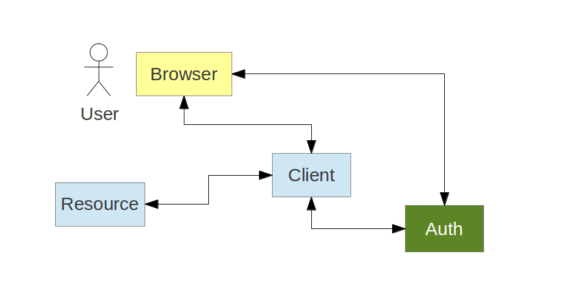

# Data Modelling for OAuth2

Dave Syer, 2013  
Twitter: @david_syer  
Email: dsyer@gopivotal.com

## 


## Agenda
* Quick overview of [OAuth2][oauth2wiki]?
* Data Modelling for OAuth2
* Spring OAuth
* Cloud Foundry [UAA]
[oauth2wiki]: http://en.wikipedia.org/wiki/OAuth#OAuth_2.0
[UAA]: http://github.com/cloudfoundry/uaa

## Quick Introduction to OAuth2

> A Client application, often web application, acts on behalf of a
> User, but with the User's approval

* Authorization Server
* Resource Server
* Client application

Common examples of Authorization Servers on the internet:

* [Facebook][] - Graph API
* [Google][] - Google APIs
* [Cloud Foundry][cfuaa] - Cloud Controller

[Facebook]: http://developers.facebook.com
[Google]: http://code.google.com/apis/accounts/docs/OAuth2.html
[cfuaa]: http://uaa.run.pivotal.io

## OAuth2 Key Features

* Extremely simple for clients
* Access tokens carry information (beyond identity)
* Resource Servers are free to interpret tokens

* Example token contents:
    * Client id
    * Resource id (audience)
    * User id
    * Role assignments

## OAuth2 Bearer Tokens

* OAuth 2.0 tokens are opaque to clients (so might be simple keys to a backend store)
* But they carry important information to Resource Servers
* Example of implementation (from Cloud Foundry UAA, JWT = signed,
  base64-encoded, JSON):

```json
{  "client_id":"vmc",
   "exp":1346325625,
   "scope":["cloud_controller.read","openid","password.write"],
   "aud":["openid","cloud_controller","password"],
   "user_name":"vcap_tester@vmware.com",
   "user_id":"52147673-9d60-4674-a6d9-225b94d7a64e",
   "email":"vcap_tester@vmware.com",
 "jti":"f724ae9a-7c6f-41f2-9c4a-526cea84e614" }
 ```

## Web Application Client

The Client wants to access a Resource on behalf of the User



## Obtaining a User Token

A client can act on behalf of a user (e.g. `authorization_code` grant):


## Authorization Code Grant Summary

1. Authorization Server authenticates the User

2. Client starts the authorization flow and obtain User's approval

3. Authorization Server issues an authorization code (opaque one-time
token)

4. Client exchanges the authorization code for an access token.

## Role of Client Application

* Register with Authorization Server (get a `client_id` and maybe a
  `client_secret`)
* Do not collect user credentials
* Obtain a token (opaque) from Authorization Server
    * On its own behalf - `client_credentials`
    * On behalf of a user
* Use it to access Resource Server

## Role of Resource Server

1. Extract token from request and decode it
2. Make access control decision
    * Scope
    * Audience
    * User account information (id, roles etc.)
    * Client information (id, roles etc.)
3. Send 403 (FORBIDDEN) if token not sufficient

## Role of the Authorization Server

1. Grant tokens
2. Interface for users to confirm that they authorize the Client to act
on their behalf
3. Authenticate users (`/authorize`)
4. Authenticate clients (`/token`)

\#1 and \#4 are covered thoroughly by the spec; \#2 and \#3 not (for
good reasons).

## More on Scopes

Per the spec they are arbitrary strings.  The Authorization Server and
the Resource Servers agree on the content and meanings.

Examples:

* Google: `https://www.googleapis.com/auth/userinfo.profile`
* Facebook: `email`, `read_stream`, `write_stream`
* UAA: `cloud_controller.read`, `cloud_controller.write`, `scim.read`,
  `openid`
  
Authorization Server has to decide whether to grant a token to a given
client and user based on the requested scope (if any).

## Links

* [http://github.com/springsource/spring-security-oauth]()
* [http://github.com/cloudfoundry/uaa]()
* [http://blog.cloudfoundry.org]()
* [http://spring.io/blog]()
* [http://dsyer.com/decks/oauth-model-s2gx.md.html]()
* Twitter: @david_syer  
* Email: dsyer@vmware.com
