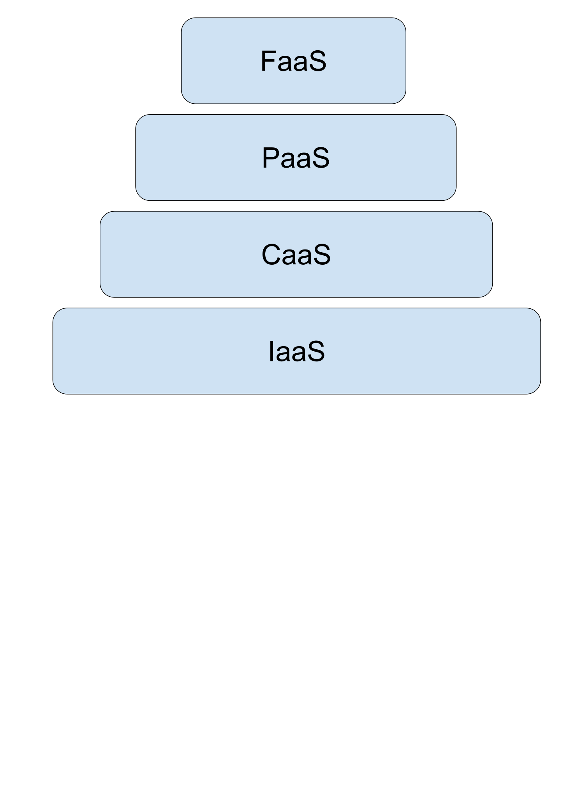

= The Road to Serverless: Spring Cloud Function
@david_syer, 2017
:backend: deckjs
:deckjs_transition: fade
:navigation:
:menu:
:status:
:goto:
:source-highlighter: pygments
:deckjs_theme: spring
:deckjsdir: ../deck.js

== Agenda

* Cloud abstractions, and serverless
* Spring Cloud Function
* Raising the value line

http://markfisher/spring-cloud-function +
http://projectreactor.io/

== Cloud Abstractions

image::images/cloud_abstraction_layers.svg[cloud-abstractions]

== Cloud Services



== Serverless and Functions

* Event driven
* Dynamic resource utilization
* Billing per message
* Prototypes become production code really quickly
* Focus on business logic

== Business Logic and the Value Line

_Paraphrasing @adrianco:_

[.big]
Get out of the business of infrastructure *and* +
automation (a.k.a. "undifferentiated heavy lifting")

== Business Logic and the Value Line

{nbsp} +

[.big]
Get out of the business of infrastructure *and* +
automation (a.k.a. "undifferentiated heavy lifting") + 
*and* integration spaghetti

== Amazon Lambda

image::images/aws_lambda_screenshot.png[aws_lambda_screenshot]

== Google Cloud Function

image::images/gcp_function_screenshot.png[gcp_function_screenshot]

== Serverless Providers

* (J) Amazon Lambda
* Google Cloud Functions
* (J) Azure Function
* (J) IBM OpenWhisk
* (J) Oracle Fn
* Fission
* Kubeless
* (J) Sk8s
* ...

(J) = native Java support +
Others can run Java via node JRE launcher.

== Java Util Function

```java
public interface Function<T, R> {
    R apply(T t);
}

public interface Consumer<T> {
    void accept(T t);
}

public interface Supplier<T> {
    T get();
}
```

== Spring Cloud Function

```java
@SpringBootApplication
public class Application {

  @Bean
  public Function<String, String> uppercase() {
    return value -> value.toUpperCase();
  }

  public static void main(String[] args) {
    SpringApplication.run(Application.class, args);
  }
}
```

== Plain Old Functions

```java
package functions;

public class Uppercase implements Function<String, String> {

  String apply(String input) {
    return input.toUpperCase();
  }

}
```

== Spring Cloud Function Web


== Spring Cloud Function

> All the benefits of serverless, but with full access to Spring (dependency injection,
> integrations, autoconfiguration) and build tools (testing, continuous delivery, run
> locally)

For Spring devs: a smaller, more familiar step than using FaaS APIs and UIs
natively

For Functionistas: no need to know anything about Spring

> Decouple lifecycle of business logic from runtime platform. Run the same code as a web
> endpoint, a stream processor, or a task

Uniform programming model across serverless providers, and also able to run standalone
(locally or in a PaaS)

== Project Reactor

```java
public abstract class Flux<T> implements Publisher<T> {
...
}


public abstract class Mono<T> implements Publisher<T> {
...
}
```

== Spring Cloud Function

```java
@SpringBootApplication
public class Application {

  @Bean
  public Function<Flux<String>, Flux<String>> uppercase() {
    return flux -> flux
        .filter(this::isNotRude)
        .map(String::toUpperCase);
  }

  boolean isNotRude(String word) {
    ...
  }

  public static void main(String[] args) {
    SpringApplication.run(Application.class, args);
  }
}
```

== Spring Cloud Function Stream


== Spring Cloud Function Adapter

image::images/function_demo_adapter.svg[function_demo_adapter]

== Spring Cloud Function

1. Programming model: `@Beans` of type `Function`, `Consumer` and `Supplier`

2. Component scan for functions (e.g. execute jar with no dependency on Spring at all)

3. Compile strings which are Java function bodies

4. Deploy app with an isolated classloader (JVM packing)

5. Adapters for AWS Lambda, and other "serverless"
service providers

== Links

* Spring Cloud Function: https://github.com/markfisher/spring-cloud-function
* Sk8s: https://github.com/markfisher/sk8s
* Spring Boot Thin Launcher: https://github.com/dsyer/spring-boot-thin-launcher
* Fission: http://fission.io/
* Spring Initializr: http://start.spring.io
* Spring Cloud: http://cloud.spring.io
* Reactor: http://projectreactor.io
