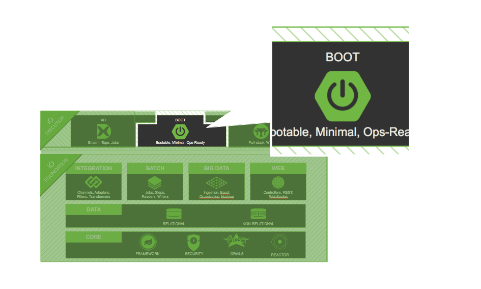

# <i class="icon-off"></i> Spring Boot

Dave Syer, Phil Webb, 2013  
Twitter: `@david_syer`, `@phillip_webb`  
Email: [dsyer, pwebb]@gopivotal.com

(Introduction to Spring Boot)

## 


## 



## Agenda
* Quick overview of goals and high level features
* Getting started demo
* Application configuration with Spring Boot
* Spring.IO website

## Focus Attention

</img>

## Introduction

<i class="icon-off icon-3x"></i> Spring Boot:

* Focuses attention at a single point (as opposed to large collection
  of `spring-*` projects)
* A tool for getting started very quickly with Spring
* Common non-functional requirements for a "real" application
* Exposes a lot of useful features by default
* Gets out of the way quickly if you want to change defaults

> An opportunity for Spring to be opinionated

## Getting Started *Really* Quickly

```groovy
@RestController
class Example {

    @RequestMapping("/")
    public String hello() {
        return "Hello World!";
    }

}
```

```
$ spring run app.groovy
```

<br/><br/>... application is running at [http://localhost:8080](http://localhost:8080)

## What Just Happened?

```groovy
// import org.springframework.web.bind.annotation.RestController
// other imports ...

@RestController
class Example {

    @RequestMapping("/")
    public String hello() {
        return "Hello World!";
    }

}
```

## What Just Happened?

```groovy
// import org.springframework.web.bind.annotation.RestController
// other imports ...

// @Grab("spring-boot-web-starter")
@RestController
class Example {

    @RequestMapping("/")
    public String hello() {
        return "Hello World!";
    }

}
```

## What Just Happened?

```groovy
// import org.springframework.web.bind.annotation.RestController
// other imports ...

// @Grab("spring-boot-web-starter")
// @EnableAutoConfiguration
@RestController
class Example {

    @RequestMapping("/")
    public String hello() {
        return "Hello World!";
    }

}
```

## What Just Happened?

```groovy
// import org.springframework.web.bind.annotation.RestController
// other imports ...

// @Grab("spring-boot-web-starter")
// @EnableAutoConfiguration
@RestController
class Example {

    @RequestMapping("/")
    public String hello() {
        return "Hello World!";
    }

//  public static void main(String[] args) {
//      SpringApplication.run(Example.class, args);
//  }
}
```

## Getting Started in Java

```java
import org.springframework.boot.SpringApplication;
import org.springframework.boot.autoconfigure.EnableAutoConfiguration;
import org.springframework.context.annotation.*;

@RestController
@EnableAutoConfiguration
public class MyApplication {

  @RequestMapping("/")
  public String sayHello() {
    return "Hello World!";
  }

  public static void main(String[] args) {
    SpringApplication.run(MyApplication.class, args);
  }

}
```

## Starter POMs

```groovy
@Grab('spring-boot-starter-web')
```

or

```xml
<dependency>
  <groupId>org.springframework.boot</groupId>
  <artifactId>spring-boot-starter-web</artifactId>
</dependency>
```

* Standard Maven POMs
* Optional parent
* Available for web, batch, integration, data
* e.g. data = hibernate + spring-data + JSR 303

## SpringApplication

```java
SpringApplication app = new SpringApplication(MyApplication.class);
app.setShowBanner(false);
app.run(args);
```

* Gets a running Spring `ApplicationContext`
* Uses `EmbeddedWebApplicationContext` for web apps
* Can be a single line: `SpringApplication.run(MyApplication.class, args)`
* Or customized...

## Not a Web Application?

* `CommandLineRunner` is a hook to run application-specific code after 
the context is created

```java
@Component
public class Startup implements CommandLineRunner {
	
	@Override
	public void run(String... args) throws Exception {
		System.out.println("Hello World");
    }

}
```

## Currently Available Autoconfigured Behaviour

* Embedded servlet container (Tomcat or Jetty)
* JDBC: `DataSource` and `JdbcTemplate`
* JPA, JMS, AMQP (Rabbit), AOP
* Websocket
* Spring Data JPA (scan for repositories) and Mongodb
* Thymeleaf
* Mobile
* Batch processing
* Reactor for events and async processing
* Actuator features (Security, Audit, Metrics, Trace)

_Please open an issue on github if you want support for something else_

## SpringApplicationBuilder

Flexible builder style with fluent API for building
`SpringApplication` with more complex requirements.

```java
new SpringApplicationBuilder(ParentConfiguration.class)
    .profiles("adminServer", "single")
    .child(AdminServerApplication.class)
    .run(args);
```

## Environment and Profiles

* Every `ApplicationContext` has an `Environment`
* Spring `Environment` available since 3.1
* Abstraction for key/value pairs from multiple sources
* Used to manage `@Profile` switching
* Always available: `System` properties and OS `ENV` vars

## Externalizing Configuration to Properties

Just put `application.properties` in your classpath or next to you jar, e.g.

`application.properties`

```properties
server.port: 9000
```

Properties can be overridden (`command line arg` > `file` > `classpath`)

## Binding Configuration To Beans

`MyProperties.java`

```java
@ConfigurationProperties(prefix="mine")
public class MyPoperties {
    private Resource location;
    private boolean skip = true;
    // ... getters and setters
}
```

`application.properties`

```properties
mine.location: classpath:mine.xml
mine.skip: false
```

## Packaging For Production

```sh
$ spring run *.groovy
```
or

```sh
$ java -jar yourapp.jar
```

* Easy to understand structure
* No unpacking or start scripts required
* Typical REST app ~10Mb
* Cloud Foundry friendly (works out of box & fast to upload)

## Spring Boot Modules

* Spring Boot - main library supporting the other parts of Spring Boot
* Spring Boot Autoconfigure - single `@EnableAutoConfiguration`
  annotation creates a whole Spring context
* Spring Boot Starters - a set of convenient dependency descriptors
  that you can include in your application.
* Spring Boot CLI - compiles and runs Groovy source as a Spring
  application
* Spring Boot Actuator - common non-functional features that make an
  app instantly deployable and supportable in production
* Spring Boot Tools - for building and executing self-contained JAR
  and WAR archives
* Spring Boot Samples - a wide range of sample apps

## Spring Boot Module Relations


## The Actuator

```groovy
@Grab('spring-boot-starter-actuator')
```

Adds common non-functional features to your application and exposes
MVC endpoints to interact with them.

* Security
* Secure endpoints: `/metrics`, `/health`, `/trace`, `/dump`, `/shutdown`, `/beans`, `/env`
* `/info`
* Audit

If embedded in a web app or web service can use the same port or a
different one (`management.port`) and/or a different network interface
(`management.address`) and/or context path (`management.context_path`).

## Spring.IO Website

* [http://spring.io](http://spring.io)
* Project by Pivotal Labs London, 2013
* Source code (not yet public) [https://github.com/spring-io/spring.io](https://github.com/spring-io/spring.io)

## Links

* [http://projects.spring.io/spring-boot](http://projects.spring.io/spring-boot) Documentation
* [https://github.com/spring-projects/spring-boot](https://github.com/spring-projects/spring-boot) Spring Boot on Github
* [http://spring.io/blog](http://spring.io/blog)
* [http://dsyer.com/presos/decks/spring-boot-intro.html](http://dsyer.com/presos/decks/spring-boot-intro.html)
* Twitter: `@david_syer`, `@phillip_webb` 
* Email: dsyer@gopivotal.com, pwebb@gopivotal.com

## 

<div id="center">
<div><i class="icon-smile icon-4x"></i> Spring Boot Intro - END <i class="icon-off icon-rotate-90 icon-4x"></i></div>
</div>
