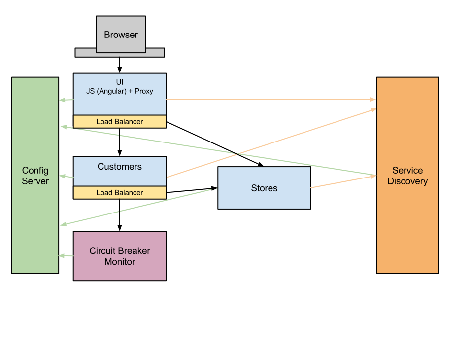
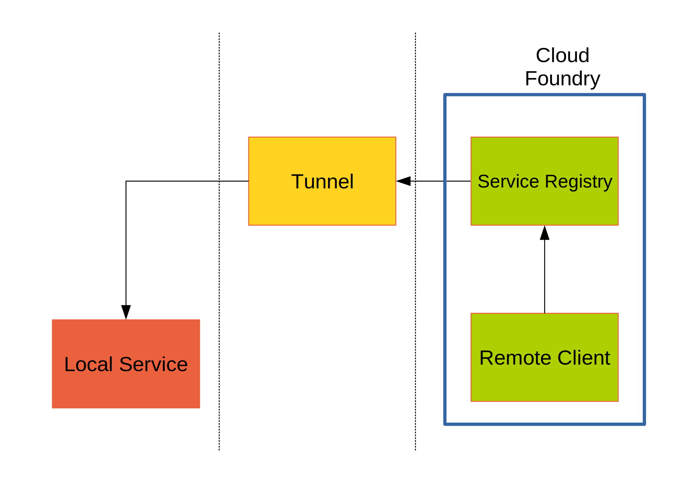
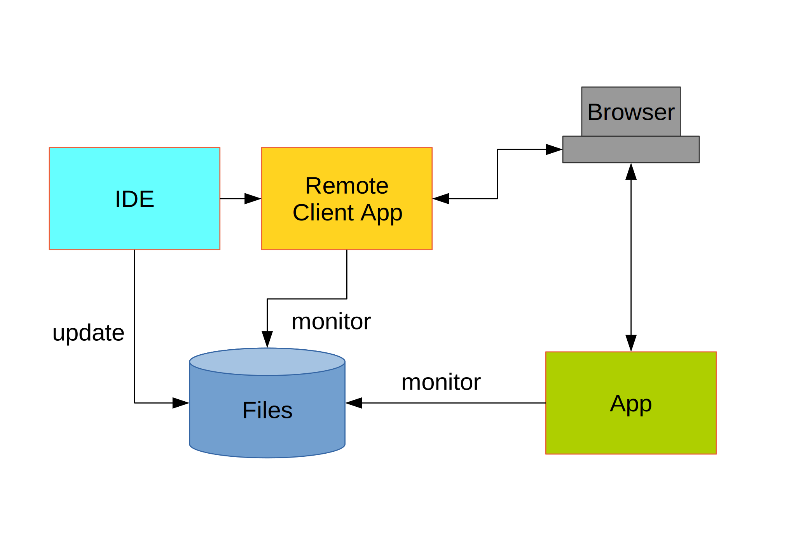

= Developer Experience with Spring Cloud
Spencer Gibb, Dave Syer, 2015
:backend: deckjs
:deckjs_transition: fade
:navigation:
:menu:
:goto:
:status:
:source-highlighter: pygments
:deckjs_theme: spring
:deckjsdir: ../deck.js

== Authors

Spencer Gibb, +
http://twitter.com/spencerbgibb[@spencerbgibb], +
sgibb@pivotal.io

Dave Syer, +
http://twitter.com/david_syer[@david_syer], +
dsyer@pivotal.io

== Developer Experience

* Microservices lead to a very open flexible architecture
* Developer needs to work on isolated codebase
* No-one wants to re-deploy the universe for every commit
* What tools and techniques are available to help?

== Database/middleware: Docker

* standard docker images exist for all common middleware
* perfect for development
* can be used in production with care

== Middleware: Discovery and DI

> How to wire up your application code to required middleware, and make the same code run in all environments?

* be Cloud Native
* use autoconfiguration
* use Service Discovery and Registry patterns
* use Spring Cloud Connectors (a bit: see https://spring.io/blog/2015/04/27/binding-to-data-services-with-spring-boot-in-cloud-foundry[blog])
* use http://cloud.spring.io/spring-cloud-stream[Spring Cloud Stream] for messaging

== Provisioning a system for testing

* Docker compose (great for repeatability)
* Locally with VirtualBox
* Remotely: Lattice AWS, Cloud Foundry, Kubernetes, Terraform, etc.
* CI systems native support (travis, bamboo, etc.)

== Debugging and fault finding

> Your app won't always work first time. How to diagnose the problem?

* dynamic log levels at runtime
* actuator endpoints: /env, /trace, /mappings, /autoconfig
* feature switches
* remote debugger (see later: Spring Boot Devtools)
* deploy locally
* distributed tracing (http and messages)
* https://ngrok.com (http proxy with replay)

== Service discovery background

== Routing from remote system to IDE

* local dev experience
* use proxy to tunnel back to IDE (e.g. ngrok)
* Spring Tool Suite and Boot Dashboard

== Loadbalancer configuration models

* flag to enable local route
* prefer route that “looks local”
* flag a request (e.g. header with correlation ID)

== Customizing Ribbon

* Ribbon is a client-side smart load-balancer from Netflix OSS
* `IRule`: Load-balancing algorithm (round-robin, random, etc...)
* `ServerList`: Where to get the list of servers to load-balance.
* `ServerListFilter`: filters list of servers.
* `@RibbonClient`: allows configuration for a named ribbon client.

== Stubbing

High level:

* Greenfield (dependent services don't exist yet, write stubs)
* Brownfield (dependent services exist and have published artifacts)

Example tools/approaches:

* publish producer stubs vs. consumer tests
* "forced stubbing": micro-infra from 4finance
* ad-hoc stubbing: accurest, wiremock, stubby4j, Spring MVC
* embedded stubs vs. remote stubs

== Stubbing Brownfield Services

* Create http://wiremock.org/stubbing.html[Wiremock] stubs using tests or dsl
** https://github.com/Codearte/accurest[AccuREST] uses a groovy dsl to create integration tests and stubs.
** https://github.com/spring-projects/spring-restdocs[Spring REST Docs] uses tests to generate snippets for documentation and can be used to create stubs.
* Run Wiremock using generated stubs
* Run consuming services against Wiremock stubs

== Stubbing: AccuREST DSL

Generates a MockMVC test and a Wiremock stub

[source,groovy]
----
import io.codearte.accurest.dsl.GroovyDsl

GroovyDsl groovyDsl = GroovyDsl.make {
    request {
        method 'GET'
        url '/foo'
    }
    response {
        status 200
        headers {
            header 'Content-Type' : 'application/json;charset=UTF-8'
        }
        body '''{ "value" : 42 }'''
    }
}
----

== Stubbing: Spring REST Docs

[source,java,subs="verbatim,quotes"]
----
@Before
public void setup() {
    this.mockMvc = MockMvcBuilders.webAppContextSetup(this.context)
        .apply(_documentationConfiguration_()
                .snippets().withDefaults(_curlRequest_(),
                    _httpRequest_(),
                    _httpResponse_(),
                    new WiremockStubSnippet()))
        .build();
}

@Test
public void foo() {
    this.mockMvc.perform(_get_("/foo")
        .accept(MediaType.APPLICATION_JSON))
        .andExpect(_status()_.isOk())
        .andDo(_document_("foo"));
}
----

== Stubbing: Wiremock Stub

[source,json]
----
{
    "request": {
        "method": "GET",
        "url": "/foo"
    },
    "response": {
        "status": 200,
        "headers": {
            "Content-Type": "application/json;charset=UTF-8"
        },
        "body": "{\"value\":42}"
    }
}
----

== Stubbing: 4finance stubrunner

* Publish stub files to nexus repository (or local maven repo)
* Describe all services dependencies in `application.yml`
* Stubrunner uses list of dependencies
** Grabs stubs from repository
** Runs a wiremock server for each dependency using fetched stubs
** Registers server in service discovery
* Consuming service can function against stubs

== Greenfield Stubbing: Spring MVC

[source,java]
----
@Controller
public class StubFleetLocationServiceApplication {

	@RequestMapping("/locations")
	public String home() {
		return "forward:/stubs/locations.json";
	}

	...

}
----

Nice side effect: mock MVC and restdocs for tests and docs can be
reused to verify real service contract

== Hot reloading and code swapping

* Basic IDE features (JVM hotswap and resource reload)
* Spring Boot devtools - app restart and browser plugin
* STS
* Spring Loaded (Grails, JHipster)
* JRebel

== Devtools locally

> App monitors its classpath and restarts when changes detected:

image::images/hot-reload-local-arch-no-browser-plugin.svg[Hot reload local architecture no browser plugin]

== Devtools with browser

> Browser plugin automatically refreshes views:

== Hot reloading and debugging

> Hot reloading of “local” application code deployed on Cloud Foundry / Lattice

image::images/hot-reload-arch.svg[Hot reload architecture]

* Spring Boot support via devtools
* classloader flushes dirty resources
* remote debug also possible (but slow)

== Links

* http://presos.dsyer.com/decks/spring-cloud-dev-experience.html
* http://cloud.spring.io
* http://spring.io/blog
* https://github.com/spring-cloud
* https://github.com/spring-cloud-samples
* https://github.com/springone2gx2015
* https://github.com/spencergibb/spring-cloud-dependencies-sample
