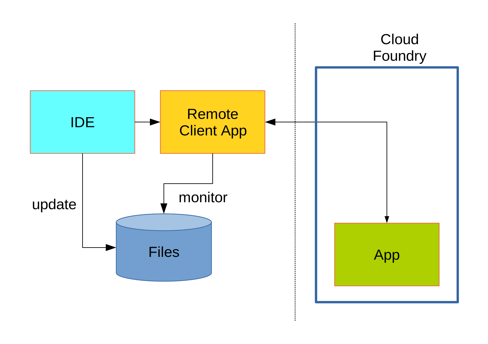

= Developer Experience with Spring Cloud
Spencer Gibb, Dave Syer, 2015
:backend: deckjs
:deckjs_transition: fade
:navigation:
:menu:
:goto:
:status:
:source-highlighter: pygments
:deckjs_theme: spring
:deckjsdir: ../deck.js

== Authors

Spencer Gibb, +
http://twitter.com/spencerbgibb[@spencerbgibb], +
sgibb@pivotal.io

Dave Syer, +
http://twitter.com/david_syer[@david_syer], +
dsyer@pivotal.io

== Cloud Native Contracts

image::images/cnc.png[cloud-native-contracts]

> With thanks to @littleidea

== Developer Experience

* Microservices lead to a very open flexible architecture
* Developer needs to work on isolated codebase
* No-one wants to re-deploy the universe for every commit
* What tools and techniques are available to help?
* How can Spring, Spring Cloud, Cloud Foundry play a role?

== Devops open data

* "if you build it you run it"
* 12-factor principles, Spring Boot and Spring Cloud Environment support
* logs (sensible defaults, stdout)
* actuator endpoints: /trace, /routes, /mappings, /env, /configprops, /beans, /autoconfig

== Debugging and fault finding

> Your app won't always work first time. How to diagnose the problem?

* collecting logs from remote system (/logs endpoint and `cf logs`)
* changing log levels at runtime
* feature switches
* remote debugger (see later: Spring Boot Devtools)
* deploy locally

== Service discovery background

image::images/CustomersStoresSystem.svg[customer-stores-system]

== Spring Cloud Discovery

* `spring-cloud-commons`: useful abstractions `DiscoveryClient`, `LoadBalancer`, `@EnableServiceDiscovery`
* `spring-cloud-netflix`: Eureka and Ribbon
* `spring-cloud-consul`: Hashicorp Consul
* `spring-cloud-zookeeper`: Zookeeper
* `spring-cloud-cloudfoundry`: cloud controller API
* `spring-cloud-lattice`: receptor (diego controller) API

== Cloud Foundry native discovery

* Uses the Cloud Controller API
* Discovery only, no registration
* Requests are made through gorouter

== Lattice native discovery

* Uses the Receptor API from Diego
* Discovery only, no registration
* Adds 'cloud' and 'lattice' profiles
* Connectors (using service name)
** Mysql, Redis & Rabbitmq

== Eureka on Lattice & Cloud Foundry

* Eureka can run on Lattice and CF
* Provides discovery and registration
* Can be managed on Pivotal Cloud Foundry (Commercial)

== Routing from remote system to IDE

image::images/local-dev-arch.svg[Local dev architecture]

* local dev experience
* use proxy to tunnel back to IDE (e.g. ngrok)
* demo with Boot Dashboard

== Loadbalancer configuration models

* flag to enable local route
* prefer route that “looks local”
* flag a request (e.g. header with correlation ID)

== Customizing Ribbon

* Ribbon is a client side smart load-balancer from Netflix OSS
* `IRule`: Load-balancing algorithm (round-robin, random, etc...)
* `ServerList`: Where to get the list of servers to load-balance.
** `ConfigurationBasedServerList`:
*** `ribbon.<clientname>.listOfServers` property
** `DiscoveryEnabledNIWSServerList`: via eureka
** `ConsulServerList`: via hashicorp consul
** `ZookeeperServerList`: ...
* `ServerListFilter`: filters list of servers.

== Ribbon Annotations

* `@RibbonClients`
** Optionally defines default java config classes for all ribbon clients.
** Allows multiple `@RibbonClient` annotations.
* `@RibbonClient`: allows configuration for a named ribbon client.

== Ribbon in Integration Tests

[source,java]
----
@RunWith(SpringJUnit4ClassRunner.class)
@SpringApplicationConfiguration(classes = MyTests.Application.class)
@WebIntegrationTest(randomPort = true)
public class MyTests { /*...*/
  @Configuration
  @RibbonClient(name = "localapp",
       configuration = LocalRibbonClientConfig.class)
  protected static class Application { /*...*/ }

  @Configuration
  static class LocalRibbonClientConfig {
    @Value("${local.server.port}")
    private int port = 0;

    @Bean
    public ServerList<Server> ribbonServerList() {
      return new StaticServerList<>(new Server("localhost", this.port));
    }
  }
}
----

== Stubbing

* “forced stubbing”: micro-infra from 4finance
* ad-hoc stubbing: accurest, wiremock, stubby4j, Spring MVC
* embedded stubs vs. remote stubs

High level:

* Greenfield (dependent services don't exist yet, write stubs)
* Brownfield (dependent services exist and have published stubs)

== Stubbing Brownfield Services

* Create http://wiremock.org/stubbing.html[Wiremock] stubs using tests or dsl
** https://github.com/Codearte/accurest[AccuREST] uses a groovy dsl to create integration tests and stubs.
** https://github.com/spring-projects/spring-restdocs[Spring REST Docs] uses tests to generate snippets for documentation and can be used to create stubs.
* Run Wiremock using generated stubs
* Run consuming services against Wiremock stubs

== Stubbing: AccuREST DSL

Generates a MockMVC test and a Wiremock stub

[source,groovy]
----
import io.codearte.accurest.dsl.GroovyDsl

GroovyDsl groovyDsl = GroovyDsl.make {
    request {
        method 'GET'
        url '/foo'
    }
    response {
        status 200
        headers {
            header 'Content-Type' : 'application/json;charset=UTF-8'
        }
        body '''{ "value" : 42 }'''
    }
}
----

== Stubbing: Spring REST Docs

[source,java]
----
@Before
public void setup() {
    this.mockMvc = MockMvcBuilders.webAppContextSetup(this.context)
        .apply(documentationConfiguration()
                .snippets().withDefaults(curlRequest(),
                    httpRequest(),
                    httpResponse(),
                    new WiremockStubSnippet()))
        .build();
}

@Test
public void foo() {
    this.mockMvc.perform(get("/foo")
        .accept(MediaType.APPLICATION_JSON))
        .andExpect(status().isOk())
        .andDo(document("foo"));
}
----

== Stubbing: Wiremock Stub

[source,json]
----
{
    "request": {
        "method": "GET",
        "url": "/foo"
    },
    "response": {
        "status": 200,
        "headers": {
            "Content-Type": "application/json;charset=UTF-8"
        },
        "body": "{\"value\":42}"
    }
}
----

== Greenfield Stubbing: Spring MVC

[source,java]
----
@Controller
public class StubFleetLocationServiceApplication {

	@RequestMapping("/locations")
	public String home() {
		return "forward:/stubs/locations.json";
	}

	...

}
----

Nice side effect: mock MVC and restdocs for tests and docs can be used
to verify real service contract

== Stubbing: 4finance stubrunner

* Publish stub files to nexus repository (or local maven repo)
* Describe a services dependencies in `application.yml`
* Stubrunner using list of dependencies
** Grabs stubs from repository
** Runs a wiremock server for each dependency using fetched stubs
** Registers server in service discovery
* Consuming service can function against stubs *(DEMO)*

== Hot reloading locally

> App monitors its classpath and restarts when changes detected:

== Hot reloading with browser

> Browser plugin automatically refreshes views:

image::images/hot-reload-local-arch.svg[Hot reload local architecture]

== Hot reloading and debugging

> Hot reloading of “local” application code deployed on Cloud Foundry / Lattice

* Spring Boot support via devtools
* classloader flushes dirty resources
* remote debug also possible (but slow)

== ALM

> How does new code enter a build pipeline and get promoted to production?

* always automated
* always part of CI process
* stay close to production platform (e.g. use Cloud Foundry for everything)
* don't redeploy the universe for every change

== Debugging requests

* live vs. historic
* /trace endpoint
* distributed tracing (http and messages)
* cf/lattice logs (http and messages)
* https://ngrok.com (http)

== Database/middleware: Docker

* standard docker images exist for all common middleware
* perfect for development
* can be used in production with care

== Middleware: Discovery and DI

> How to wire up your application code to required middleware, and make the same code run in all environments?

* use autoconfiguration
* use Spring Cloud Connectors (a bit)
* use Spring Cloud Stream for messaging middleware

== Provisioning a system for testing

* Docker compose (great for repeatability)
* Locally with VirtualBox
* Remotely Lattice AWS, PCF, etc.
* CI systems native support (travis, bamboo, etc.)
