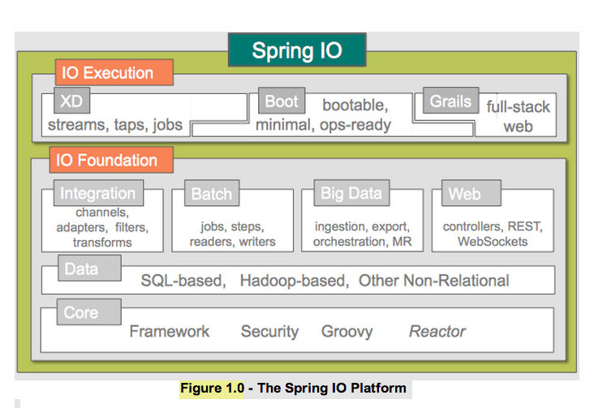

# Spring IO Platform

Adrian Colyer,
Dave Syer,  
Jergen Hoeller,
Chris Beams  

Twitter:  
  @adriancolyer  
  @david_syer  
  @cbeams  

Email: [acolyer,  
  dsyer,  
  jhoeller,
  cbeams]@gopivotal.com

## Agenda
* Big picture: What is Spring IO?
* Spring Boot overview
* Spring Boot demo
* Spring 4.0
* Spring website

## Spring IO Platform

## Spring Boot Overview

> Spring Boot makes it easy to create Spring-powered, production-grade
> applications and services with absolute minimum fuss. It takes an
> opinionated view of the Spring platform so that new and existing
> users can quickly get to the bits they need.

## Spring Boot Goals

* Provide a radically faster and widely accessible getting started experience
* Be opinionated out of the box, but get out of the way quickly as requirements start to
  diverge from the defaults
* Provide a range of non-functional features that are common to large classes of projects
  (e.g. embedded servers, security, metrics, health checks, externalized configuration)
* Absolutely no code generation and no requirement for XML configuration

## Spring Boot Demo

Spring Boot Demo

## Spring Boot FAQ

  
<i class="icon-comment-alt icon-3x pull-left"></i> 
Cool! Now what else can I do with it?  

  

1. How can I extend it?  
2. Can I use a traditional WAR deployment?

## Spring Boot Modules

## Spring 4.0

* New Baseline = JDK 6+, Servlet 3.0, and other 3rd pary OS libraries
* Latest of specs - JPA 2.1, Bean Valid 2.1, JMS 2.0, JSR-356, JSR-236
* Java 8: Lambda, method references
* WebSocket
* Messaging (and WebSocket support)
* Web improvements: async, HATEOAS, cache busting

## Spring Website

Spring Website Demo

