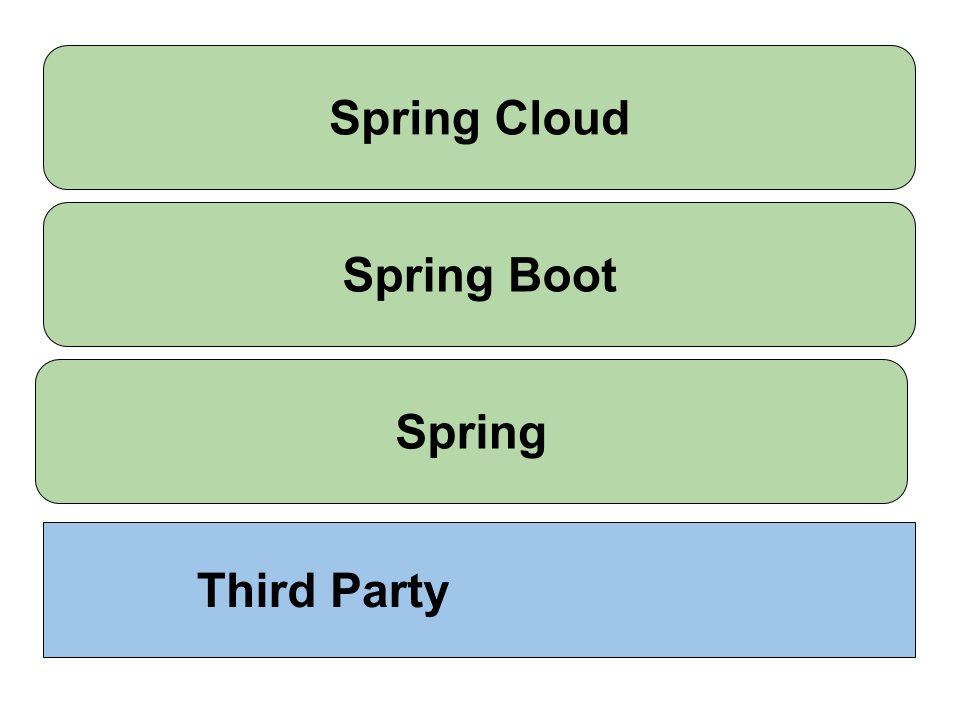
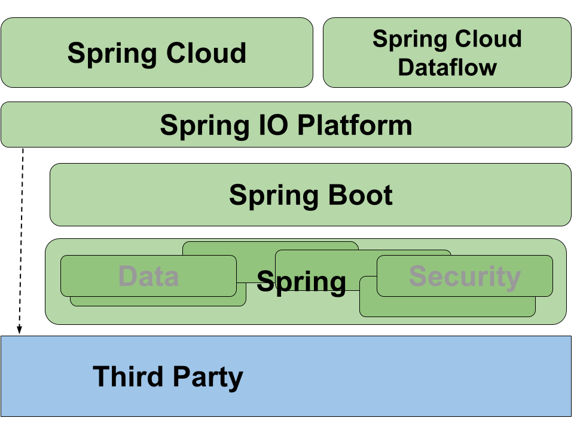

= What's New in Spring?
Dave Syer, 2017
:backend: deckjs
:deckjs_transition: fade
:navigation:
:menu:
:status:
:goto:
:source-highlighter: pygments
:deckjs_theme: spring
:deckjsdir: ../deck.js

== Agenda

* What's happening in Spring?
* How does it all fit together?

http://spring.io/projects +
http://projectreactor.io/

== Spring Layer Diagram



== Spring Layers Detail



== Spring Today

May 2017:

* Reactor: Aluminium-SR2 (3.0.7.RELEASE)
* Framework: 4.3.8.RELEASE
* Data: Ingalls-SR3
* Boot: 1.5.3.RELEASE
* Cloud: Dalston.RELEASE

== Spring 5.0

* Baseline: JDK 8, Servlet 3.1, JMS 2.0, JPA 2.1
* Performance improvements
* Functional bean configuration
* Reactive: WebFlux, Router Functions
* Support for JUnit 5, JDK 9 and HTTP/2
* Kotlin

== Spring Layers Detail


== Imperative style (Blocking)

```java
try {
    Person p = personRepository.findById(id);
    handle(p);
} catch	(IOException ex)	{
    error(ex);
}	
```

```java
interface PersonRepository {
     Person findById(String	id);
     List<Person> findAll();
     void save(Person	person);
}
```

== Functional style (Non-blocking)

```java
Mono<Person> p = personRepository.findById(id)
             .map(this::handle)
             .doOnError(this::error);
```

```java
interface PersonRepository {
     Mono<Person> findById(String id);
     Flux<Person> findAll();
     Mono<Void> save(Person	person);
}
```

{nbsp} +
{nbsp} +

* Neutral to Latency
* Event based

== Spring MVC

```java
@GetMapping("/users/{id}")
User getById(@PathVariable String id)	{
    return this.userRepository.findOne(id);
}
```

== Spring WebFlux

```java
@GetMapping("/users/{id}")
Mono<User> getById(@PathVariable String id)	{
    return this.userRepository.findOne(id);
}
```

== Router Function

```java
@Bean
public RouterFunction<?> userEndpoints() {
    return route(GET("/users/{id}"), request -> 
        ok().body(
            repository.findOne(request.pathVariable("id")),
            User.class
        ));
}
```

== Spring WebClient

```java
WebClient client = WebClient.create(); 

Mono<GithubUser> githubUser = client 
    .get() 
    .uri("https://api.github.com/users/{username}", username)
    .retrieve() 
    .bodyToMono(GithubUser.class); 
```

== Spring WebClient Scatter Gather

```java
Mono<TwitterUser> twitterUser = client 
    .get() 
    .uri("https://api.twitter.com/1.1/users/show.json?screen_name={username}", username)
    .retrieve() 
    .bodyToMono(TwitterUser.class); 

return githubUser.and(twitterUser, 
    (github, twitter)-> new AppUser(github, twitter));
```

== Reactive Spring

> More for scalability and stability than for speed

Servlets and Web MVC are not going to go away.

== Spring Releases

https://spring-calendar.cfapps.io/

|===
|Project | Release | Timeline

|Reactor |Bismuth | {nbsp}
|Framework | 5.0.0.RELEASE | 2017Q2
| Data     | Kay | {nbsp}
| Security | 5.0.0.RELEASE |{nbsp}
| Integration | 5.0.0.RELEASE |{nbsp}
| ... | {nbsp} |{nbsp}
| Boot     |2.0.0.RELEASE  | 2017Q4
| Cloud    | Finchley.RELEASE |{nbsp}

|===

== Spring Cloud

* Dalston: 2017Q1, Spring Boot 1.5.x
* Edgware: 2017Q3, Spring Boot 1.5.x
        - Spring Cloud Dataflow
* Finchley: 2017Q4: Spring Boot 2.0.x
        - Spring Cloud Function
        - Spring Cloud Gateway

== Spring Cloud

* Dalston: 2017Q1, Spring Boot 1.5.x
* Edgware: 2017Q3, Spring Boot 1.5.x
        - Spring Cloud Dataflow
        - Spring Cloud Function
* Finchley: 2017Q4: Spring Boot 2.0.x
        - Spring Cloud Gateway

== Links
* Spring Initializr: http://start.spring.io
* Spring Boot: http://projects.spring.io/boot
* Spring Cloud: http://cloud.spring.io
* Reactor: http://projectreactor.io
* Reactive Types: https://spring.io/blog/2016/04/19/understanding-reactive-types
* http://www.reactive-streams.org
